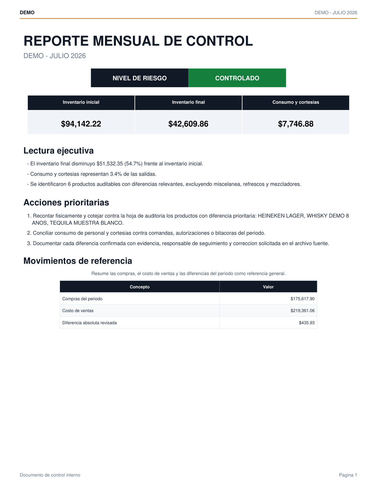
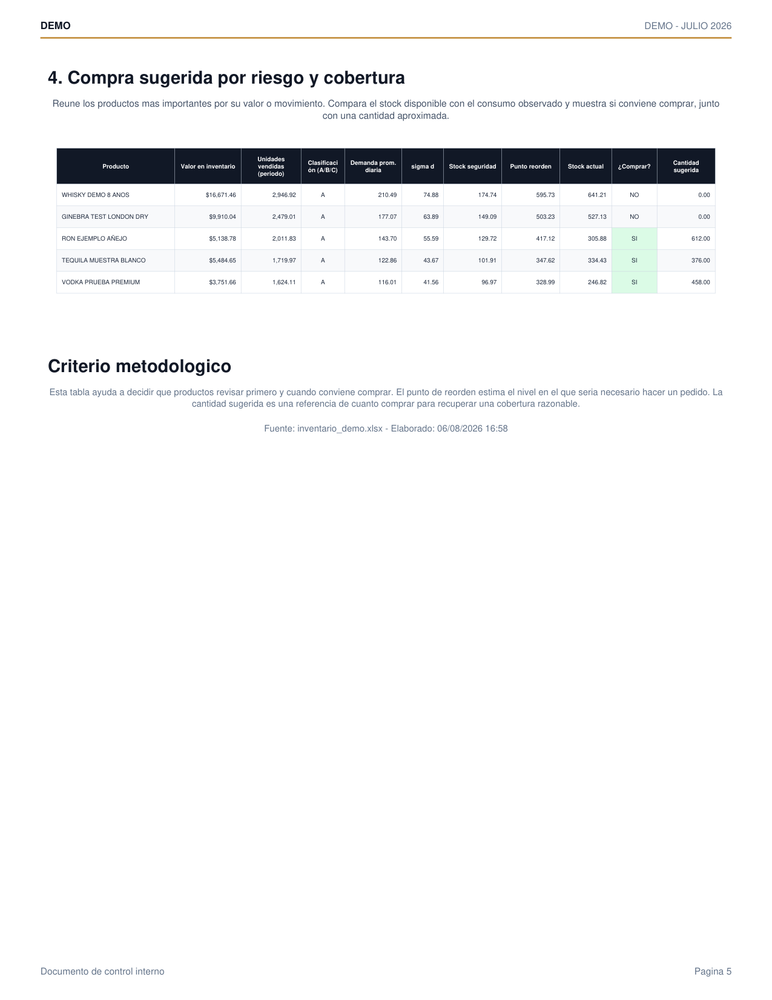
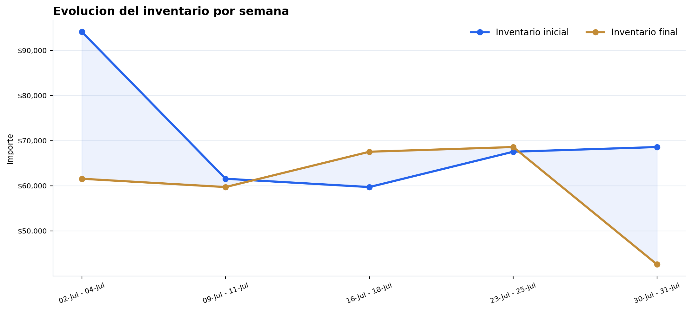
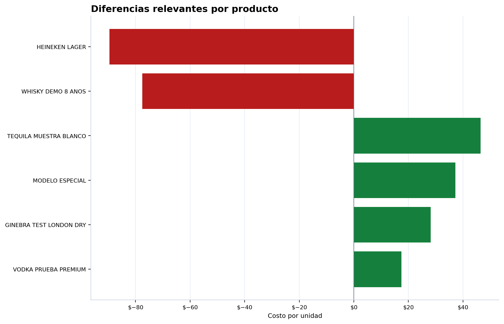

# Reporte mensual automatizado de inventario, mermas y compras

Pipeline en Python que convierte las hojas de conteo diario de un bar/restaurante (Excel, una hoja por día de operación) en un **reporte ejecutivo en PDF** y un **workbook analítico en Excel**, sin intervención manual: limpieza de datos, cálculo de KPIs, motor de alertas por severidad, clasificación ABC y sugerencia de compra por punto de reorden.

> Los datos de este repositorio son **100% sintéticos** (ver [`datos_demo/`](datos_demo/)). El código es el mismo que uso en producción para el control de inventario real de un negocio de bares, solo que aquí corre contra un Excel de ejemplo en vez de las cifras reales de la empresa.

## Contexto del problema

En un bar/antro, cada día que hay operación el jefe de barra hace un conteo físico de botellas, cervezas, refrescos e insumos, y lo entrega en un Excel con inventario inicial, compras, ventas y mermas. Al cierre de cada semana esos conteos se auditan y se acumulan en un maestro mensual. Al final del mes hay que convertir semanas de conteos crudos en un diagnóstico único: ¿cuánto capital hay inmovilizado en inventario?, ¿qué productos tienen diferencias que no cuadran?, ¿qué tan grave es cada diferencia?, ¿qué conviene comprar la próxima semana?

Hacer esto a mano en Excel cada mes es lento y propenso a error. Este proyecto automatiza todo el proceso, desde el Excel crudo hasta el PDF listo para presentar.

## Qué hace el pipeline

1. **Ingesta y limpieza** — lee todas las hojas diarias de un Excel (una hoja por fecha), detecta metadata desde el nombre de la hoja (negocio, mes, día de la semana, día), normaliza texto, corrige formatos numéricos inconsistentes (comas, puntos, errores de fórmula de Excel) y reconstruye columnas cuando el archivo fuente viene incompleto.
2. **Cálculo de negocio** — inventario teórico vs. inventario real, diferencias en unidades y en costo, clasificación automática por tipo de producto (botella, cerveza, refresco/mezclador, misceláneo), agregados por día, semana y mes.
3. **Motor de alertas** — detecta diferencias relevantes y las clasifica en severidad (alta/media/baja) usando umbrales de unidades y de costo configurables, excluyendo variaciones normales (mermas esperadas de misceláneos, por ejemplo).
4. **Priorización de compra** — clasificación ABC por valor en inventario y por rotación, cálculo de demanda promedio, desviación estándar, stock de seguridad (nivel de servicio configurable), punto de reorden y cantidad sugerida de compra.
5. **KPIs ejecutivos** — rotación de inventario, % de mermas/cortesías sobre salidas, variación de inventario, score de riesgo compuesto.
6. **Reporte final** — un Excel con más de diez hojas formateadas (tablas, colores condicionales, congelado de encabezados) y un PDF ejecutivo con gráficas, diagnóstico narrativo generado dinámicamente y tablas de acción prioritaria.

## Stack

`pandas` / `numpy` para el ETL y los cálculos · `matplotlib` para las gráficas · `xlsxwriter` para el Excel con formato · `reportlab` para el PDF ejecutivo.

## Cómo correrlo

```bash
pip install -r requirements.txt
python datos_demo/generar_datos_demo.py   # genera datos_demo/inventario_demo.xlsx (sintético)
python src/reporte_mensual.py             # genera el Excel y el PDF en ejemplo_salida/
```

También corre tal cual en Google Colab (monta Drive automáticamente y descarga el PDF/Excel al terminar); los parámetros `ESTABLECIMIENTO`, `ANIO`, `MES` y `ARCHIVO_EXCEL_NOMBRE` al inicio de [`src/reporte_mensual.py`](src/reporte_mensual.py) están pensados como celdas `@param` de Colab.

## Muestra de salida (datos sintéticos)

Portada del PDF ejecutivo, con KPIs, nivel de riesgo y diagnóstico narrativo generado automáticamente:



Compra sugerida por producto: clasificación ABC, demanda promedio, punto de reorden y cantidad a comprar (resaltado en verde cuando el stock actual ya está por debajo del punto de reorden):



Gráficas de tendencia y detección de diferencias que alimentan el reporte:

| Evolución semanal de inventario | Diferencias con mayor impacto |
|---|---|
|  |  |

PDF ejecutivo completo (5 páginas): [`ejemplo_salida/muestra/reporte_demo.pdf`](ejemplo_salida/muestra/reporte_demo.pdf)
Excel analítico completo (15 hojas): [`ejemplo_salida/muestra/reporte_base_demo.xlsx`](ejemplo_salida/muestra/reporte_base_demo.xlsx)

## Estructura del repo

```
src/reporte_mensual.py          pipeline completo: ingesta -> limpieza -> calculo -> Excel -> PDF
datos_demo/generar_datos_demo.py genera un Excel de entrada sintetico con la misma estructura que el real
datos_demo/inventario_demo.xlsx  Excel de ejemplo ya generado
ejemplo_salida/muestra/          PDF, Excel, graficas y capturas de pagina ya generados, para ver el resultado sin correr nada
```

## Sobre los datos

Ningún archivo de este repositorio contiene información real de ningún negocio: nombres de productos, precios, inventarios y el propio Excel de entrada son generados aleatoriamente por [`generar_datos_demo.py`](datos_demo/generar_datos_demo.py). La estructura (nombre de hojas, columnas, reglas de negocio) es la misma que uso en producción.
